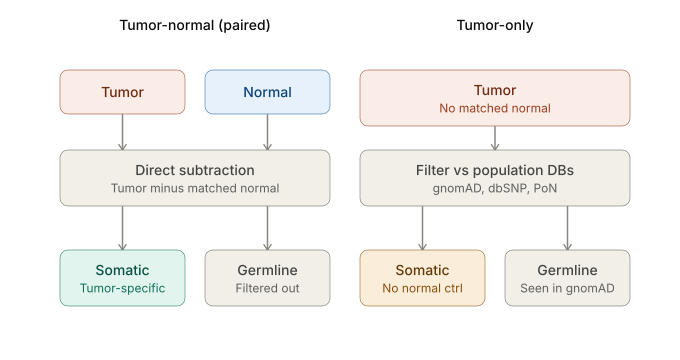
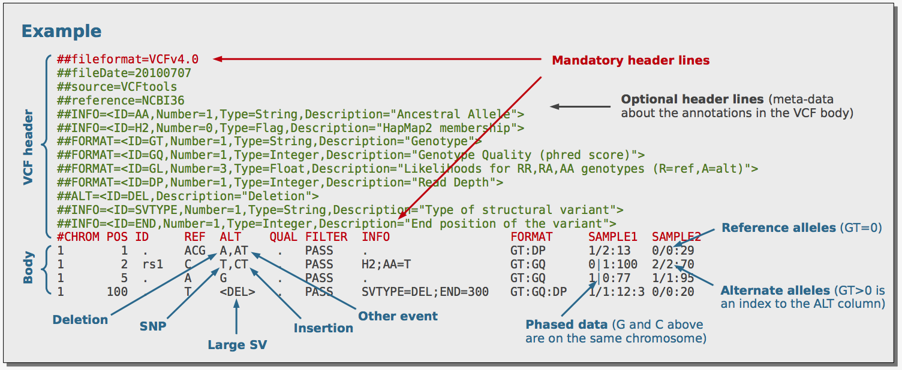

# Introduction to variant discovery and annotations in cancer data
***By Robert Eveleigh, MSc., Alan Pacis, PhD.***  
*https://github.com/c3g/GenPipes*

================================

This work is licensed under a [Creative Commons Attribution-ShareAlike 3.0 Unported License](http://creativecommons.org/licenses/by-sa/3.0/deed.en_US). This means that you are able to copy, share and modify the work, as long as the result is distributed under the same license.

================================

Welcome to this introductory tutorial on variant discovery and annotation, where you'll work through the process of identifying and interpreting genomic variants using real cancer sequencing data. 

In this workshop, we will focus only on whole genome data and provide command lines that allow detecting Single Nucleotide Variants (SNV). 
This workshop will show you how to launch individual steps of a complete DNA-Seq SNV pipeline using cancer data

## Data Source
Throughout this lab, we'll be using HCC1395, a triple-negative breast cancer cell line derived from a primary ductal carcinoma, paired with its matched normal lymphoblastoid line, HCC1395BL, derived from the same patient. 
This tumor-normal pair isn't just a convenient teaching example — it's the reference standard adopted by the SEQC2 (Sequencing Quality Control Phase 2) consortium precisely because its somatic mutations and germline variants have been exhaustively validated across multiple sequencing platforms and bioinformatics pipelines, giving us a high-confidence "truth set" to check our own results against as we learn. 
Biologically, HCC1395 is a useful sample for this kind of exercise because it carries a well-characterized germline BRCA1 loss-of-function mutation alongside a somatically acquired TP53 mutation, plus additional alterations in genes like PTEN, CDKN2A, and BRCA2 — giving you a realistic mix of germline and somatic variant types, and a chance to see firsthand how variant calling, filtering, and functional annotation come together to distinguish an inherited cancer-predisposition variant from a tumor-acquired driver mutation. 

The HCC1395 sample pair was downloaded from public SRA archive HCC1395 tumor (SRR7890943) and HCC1395BL normal (SRR7890893).
Both normal and tumor were sequenced on Illumina NovaSeq 6000 using DNA from fresh cells with TruSeq PCR free library sequenced to ~70x coverage for the tumor and ~60x coverage for the normal.

By the end of this tutorial, you'll have taken processed sequencing data from this well-studied sample through the core steps of a variant discovery workflow — variant calling, and annotation — and interpreted the biological significance of what you find.
To do this, we will use a subset of the HCC1395/HCC1395BL dataset, focusing on a specific regions of chromosome 13 and 17 that containing 2 somatic (BRCA2 and TP53) and 1 germline (BRCA1).
Using four variant callers (VarScan2, VarDict, MuTecT2 and Strelka2) we will generate a unified callset of somatic/germline variants and annotate them using the CPSR/PCGR reporting system.


**For more details about** [HCC1395](http://www.cng.fr/cagekid/)

For practical reasons we subsampled the reads for variants of interests (refseq gene boundaries for BRCA1, BRCA2, and TP53 with 2kb padding) in the table below because running the whole dataset would take way too much time and resources. 
See data/regions.bed for the exact coordinates of the regions we will be using in this practical.


### Environment setup
```{.bash}
#Spin up docker container
docker run --privileged -v /tmp:/tmp --network host -it \
    -w $PWD -v $HOME:$HOME -v /etc/fonts/:/etc/fonts/ \
    -v $HOME/cvmfs_caches/:/cvmfs-cache/ c3genomics/genpipes:v6.2.0

#Load modules and reference resources    
module purge

export REF=${MUGQIC_INSTALL_HOME}/genomes/species/Homo_sapiens.GRCh38/
export COURSE=/home/training/cbw_workshop_2026

#create and move to working directory
mkdir -p $COURSE/SNV

cd $COURSE/SNV

```

### Software requirements
The workshop commands use software provided by the MUGQIC module system in the
`c3genomics/genpipes:v6.2.0` environment. Load the modules needed for each
step with the `module load` commands in this README; the commands purge and
load modules as needed rather than requiring every tool to be loaded at once.

| Software | Version used |
| --- | --- |
| [SAMtools](https://www.htslib.org/) | 1.14 |
| [VarScan2](https://varscan.sourceforge.net/) | 2.4.3 |
| [VarDictJava](https://github.com/AstraZeneca-NGS/VarDictJava) | 1.4.8 |
| [GATK (GenomeAnalysisTK)](https://gatk.broadinstitute.org/) | 4.6.0.0 |
| [Strelka2](https://github.com/Illumina/strelka) | 2.9.10 |
| [bcftools](https://www.htslib.org/) | 1.15, 1.23 |
| [HTSlib (bgzip, tabix)](https://www.htslib.org/) | 1.14 |
| [vt](https://github.com/atks/vt) | 0.57 |
| [bcbio.variation.recall](https://github.com/chapmanb/bcbio.variation) | 0.2.6 |
| [PCGR](https://github.com/sigven/pcgr) | 2.3.1 |
| [IGVtools](https://software.broadinstitute.org/software/igv/igvtools) | 2.3.14 |
| [OpenJDK](https://openjdk.org/) | 17.0.1, 8u72 |
| [Perl](https://www.perl.org/) | 5.34.0 |
| [R / Bioconductor](https://www.bioconductor.org/) | R 4.1.0 / Bioconductor 3.13 |
| [Python](https://www.python.org/) | 3.10.4, 2.7.18 |
| [MUGQIC tools](https://github.com/MUGQIC/mugqic_tools) | 2.12.7 |

## Original Setup

The initial structure of your folders should look like this:
```
<ROOT>
|-- alignments/              # aligments from the center (down sampled)
    `-- HCC1395BL_normal     # The blood sample directory
        `-- HCC1395BL*_?     # Lane directory by run number. Contains the fastqs
    `-- HCC1395_tumor        # The tumor sample directory
        `-- HCC1395*_?       # Lane directory by run number. Contains the fastqs
|-- savedResults             # Folder containing precomputed results
|-- scripts                  # cheat sheet folder
```


### Cheat file
**You can find all the unix command lines for this practical in the file.** [commands.sh](scripts/commands.sh)


# Getting started
So you've just received an email from the sequencing center indicating that your data is ready for download.

**What should you do ?** [solution](solutions/_data.md)

You have now processed your data using best practices and should have one BAM for normal and tumor.

Let's inspect the BAM files to see what is in there.

```{.bash}
ls -l alignment/HCC1395BL_normal/
samtools view -H alignment/HCC1395BL_normal/HCC1395BL_normal.subset.bam

```
**How was this data processed?** [solution](solutions/_view1.md)

```{.bash}
samtools view -H alignment/HCC1395BL_normal/HCC1395BL_normal.subset.bam | grep "@RG"

```

You should have your 1 read group entry.

**Why did we use the -H switch?** [Solution](solutions/_view2.md)

**Try without. What happens?** [Solution](solutions/_view3.md)

# Variant Discovery in Cancer



Tumor-normal (paired): the gold standard because the normal acts as a per-patient control for both germline variation and technical artifacts.

Tumor-only: with no matched normal, callers substitute population databases (gnomAD, dbSNP, ExAC, etc.) and/or a panel of normals (PoN) to guess which variants are likely germline (common in the population) versus somatic
This is inherently weaker e.g. private/rare germline variants can get miscalled as somatic
PON can be useful to filter out recurrent technical artifacts, especially when using the same sequencing platform and library prep (WGS and WES - same baits) as the PoN samples, but it won't help with private germline variants.

Before we start variant discovery, let's look at the structure of the VCF file. 



Briefly, the VCF format is is flexible and extensible, allowing for the inclusion of various types of information about each variant in a text file format (most likely stored in a compressed manner) that contains:
- A header denoted with ## or # containing meta-data information 
- A body containing information about a position in the genome. The VCF format is flexible and extensible, allowing for the inclusion of various types of information about each variant.

Notes:
1. ##INFO=: describes the INFO field, which contains additional information about the variant, typicaly with caller-specifics, annotations etc.
2. ##FORMAT=: describes the FORMAT field, which contains information about the genotype of each sample at that position. One set of FORMAT fields is provided for each SAMPLE in the VCF file.
3. #CHROM, POS, ID, REF, ALT, QUAL, FILTER, INFO, FORMAT: these are the standard columns in the VCF file. The first 8 columns are fixed and contain information about the variant itself. The last two columns contain information about the genotype of each sample at that position.
4. The first and second variant in the example contain multi-allelic variants, which are represented in the ALT field as a comma-separated list of alternate alleles.  More on this in the following section on multi-allelic variants.

Now that we have a basic understanding of the VCF format, let's look at the different variant callers we will be using in this practical.

Until recently, the main difference between the different callers is the way they handle the data and the statistical model they use to call variants.
Most of SNV and indel callers use either Baysian, threshold or t-test approach for variant discovery. 
However, more variant discovery tools are making use of machine learning (ML), for discovery (e.g. DeepSomatic, Clair3), variant filtering, prioritization or annotations.

In this practical we will be focusing on well known non-ML variant callers.
Here we will try four variant callers.

## Variant Callers Comparison (High-level overview more will be explained in the following sections)

| Caller | Read-support model | Region-calling logic | Local realignment |
|---|---|---|---|
| **VarScan2** | mpileup counts only | Heuristic thresholds + Fisher's exact test | None |
| **VarDict** | Direct BAM read counts | Heuristic thresholds + statistical test (`testsomatic.R`) | **Yes** — on the fly, soft-clip based |
| **Mutect2** | Local reassembly (haplotype graph) | Bayesian genotype-likelihood model | Yes — full local assembly |
| **Strelka2** | Local reassembly | Bayesian mixture model | Yes — full local assembly |

many, MANY others can be found here:
https://www.biostars.org/p/19104/

We will then apply and ensemble approach to combine the results of the different callers and generate a unified callset.


In our case, let's start with:

```{.bash}
mkdir -p pairedVariants

```

## Varscan 2

VarScan2 (Koboldt et al., Genome Research, 2012) takes a fundamentally different approach from the other three callers in this practical. It uses a heuristic method and a statistical test based on the number of aligned reads supporting each allele.

The caller works directly on read counts pulled from samtools mpileup output — it never touches the BAM files itself. This is why, as we set up earlier, region restriction for VarScan2 has to happen at the mpileup step rather than through a flag native to VarScan2.

Requirements for running Samtools mpileup and VarScan2:
- A Normal/tumor SAM/BAM file that has been coordinate sorted.
- The reference sequence ("reference.fasta") to which reads were aligned, in FASTA format.
- The SAMtools software package.
- The VarScan2 software package (Java-based).


```{.bash}
# SAMTools mpileup
##Good practice to purge all modules before loading new ones
module purge && \
module load mugqic/samtools/1.14 && \
samtools mpileup -d 1000 -B -q 10 -Q 10 \
  -f ${REF}/genome/Homo_sapiens.GRCh38.fa \
  -l regions.bed \
  alignment/HCC1395BL_normal/HCC1395BL_normal.subset.bam \
  alignment/HCC1395_tumor/HCC1395_tumor.subset.bam \
  > pairedVariants/HCC1395.varscan2.mpileup

```
[note on samtools mpileup command](notes/_mpileup1.md)

The Varscan2 heuristic method refers to a set of user-configurable read-count thresholds applied at every candidate position: 
- Minimum read depth (--min-coverage, default 8), 
- Minimum number of reads supporting the variant allele (--min-reads2, default 2), 
- Minimum variant allele frequency (--min-var-freq, default 0.20 — though for tumor samples this is commonly relaxed to 0.05–0.10 to catch subclonal variants)
- Minimum base quality (--min-avg-qual, default 15)

The "statistical test" is where VarScan2 becomes specifically useful for a tumor-normal pair like HCC1395/HCC1395BL: for every position that passes the heuristic filters, 
VarScan2's somatic-calling mode (varscan somatic) applies a Fisher's exact test comparing the read counts supporting the reference vs. variant allele in the normal sample 
against the same counts in the tumor sample. Based on that comparison (and the --somatic-p-value threshold, default 0.05) each variant gets classified into one of four categories:

1. **Germline**: The variant is present in the normal sample but not in the tumor sample.
2. **Somatic**: The variant is present in the tumor sample but not in the normal sample.
3. **LOH** (Loss of Heterozygosity): The variant is present in both, but at a higher allele fraction in the tumor
4. **Unknown**: The variant cannot be classified into any of the above categories.

```{.bash}
# Varscan2
module purge && \
module load mugqic/java/openjdk-jdk-17.0.1 mugqic/VarScan/2.4.3 mugqic/htslib/1.14 mugqic/bcftools/1.15 && \
java -Xmx2000M -jar $VARSCAN2_JAR somatic \
  pairedVariants/HCC1395.varscan2.mpileup \
  pairedVariants/HCC1395.varscan2 \
  --min-coverage 3 \
  --min-var-freq 0.05 \
  --p-value 0.10 \
  --somatic-p-value 0.05 \
  --strand-filter 0 \
  --output-vcf 1 \
  --mpileup 1 && \
bgzip -cf  \
 pairedVariants/HCC1395.varscan2.snp.vcf \
  > pairedVariants/HCC1395.varscan2.snp.vcf.gz && \
tabix -pvcf pairedVariants/HCC1395.varscan2.snp.vcf.gz && \
bgzip -cf  \
 pairedVariants/HCC1395.varscan2.indel.vcf \
  > pairedVariants/HCC1395.varscan2.indel.vcf.gz && \
tabix -pvcf pairedVariants/HCC1395.varscan2.indel.vcf.gz && \
bcftools \
  concat -a \
  pairedVariants/HCC1395.varscan2.snp.vcf.gz \
  pairedVariants/HCC1395.varscan2.indel.vcf.gz | \
sed 's/TUMOR/HCC1395_NS_T_1/g'   | \
sed 's/NORMAL/HCC1395BL_NS_N_1/g' \
> pairedVariants/HCC1395.varscan2.vcf && \
bgzip -cf  \
 pairedVariants/HCC1395.varscan2.vcf \
  > pairedVariants/HCC1395.varscan2.vcf.gz && \
tabix -pvcf pairedVariants/HCC1395.varscan2.vcf.gz

```
Note: Using bgzip and tabix to compress and index the VCF files is a good practice, especially for large datasets, as it allows for efficient random access to specific regions of the file without needing to decompress the entire file.

**Note on VarScan2 parameters used above** [here](solutions/_varscan1.md)

**From the VarScan2 output, how many germline, LOH, and somatic, variants were called?** [solution](solutions/_varscan2.md)

Open the vcf file and look at the header and the first few lines of the body.

Let's look at the mandatory fields in the VCF file.

```{.bash}
# View Mandatory fields (-E means to use extended regex)
zgrep -E "##fileformat|#CHROM" pairedVariants/HCC1395.varscan2.vcf.gz
```

```
##fileformat=VCFv4.1
#CHROM	POS	ID	REF	ALT	QUAL	FILTER	INFO	FORMAT	HCC1395BL_NS_N_1	HCC1395_NS_T_1

```

The FORMAT metadata fields describe the per-sample genotype information. The body of the VCF the FORMAT field is a colon-separated list of subfields, and each sample column contains the corresponding values for those subfields.

```{.bash}
# View FORMAT fields
zgrep -E "##FORMAT" pairedVariants/HCC1395.varscan2.vcf.gz
```

```
##FORMAT=<ID=GT,Number=1,Type=String,Description="Genotype">
##FORMAT=<ID=GQ,Number=1,Type=Integer,Description="Genotype Quality">
##FORMAT=<ID=DP,Number=1,Type=Integer,Description="Read Depth">
##FORMAT=<ID=RD,Number=1,Type=Integer,Description="Depth of reference-supporting bases (reads1)">
##FORMAT=<ID=AD,Number=1,Type=Integer,Description="Depth of variant-supporting bases (reads2)">
##FORMAT=<ID=FREQ,Number=1,Type=String,Description="Variant allele frequency">
##FORMAT=<ID=DP4,Number=1,Type=String,Description="Strand read counts: ref/fwd, ref/rev, var/fwd, var/rev">
```

The INFO metadata fields describe additional information about the variant itself. The body of the VCF the INFO field is a semicolon-separated list of subfields, and each variant line contains the corresponding values for those subfields.

```{.bash}
# View INFO fields
zgrep "##INFO" pairedVariants/HCC1395.varscan2.vcf.gz
```

```
##INFO=<ID=DP,Number=1,Type=Integer,Description="Total depth of quality bases">
##INFO=<ID=SOMATIC,Number=0,Type=Flag,Description="Indicates if record is a somatic mutation">
##INFO=<ID=SS,Number=1,Type=String,Description="Somatic status of variant (0=Reference,1=Germline,2=Somatic,3=LOH, or 5=Unknown)">
##INFO=<ID=SSC,Number=1,Type=String,Description="Somatic score in Phred scale (0-255) derived from somatic p-value">
##INFO=<ID=GPV,Number=1,Type=Float,Description="Fisher's Exact Test P-value of tumor+normal versus no variant for Germline calls">
##INFO=<ID=SPV,Number=1,Type=Float,Description="Fisher's Exact Test P-value of tumor versus normal for Somatic/LOH calls">

```

Looking at the header how can you differentiate between the germline, LOH, and somatic variants? [solution](solutions/_varscan3.md)

Using the SS field in the VCF file, let's extract all variants using bcftools view variant with the somatic status.

```{.bash}
# Extract somatic variants
module purge && \
module load mugqic/bcftools/1.15 mugqic/htslib/1.14 && \
bcftools view -Oz -i 'INFO/SS="2"' -o pairedVariants/varscan2.somatic.vcf.gz \
pairedVariants/HCC1395.varscan2.vcf.gz && tabix -pvcf pairedVariants/varscan2.somatic.vcf.gz

# Sanity check (remove the header and count the number of lines)
zgrep -v "^#" pairedVariants/varscan2.somatic.vcf.gz | wc -l
```

This verifies that there are indeed 58 somatic variants, as varscan2 previously identified.

Let's look at the first somatic variant in the vcf file.

```{.bash}
# View the first somatic variant (-A1 means to show 1 line after the match)
zgrep -A1 "#CHROM" pairedVariants/HCC1395.varscan2.vcf.gz

```

```
#CHROM	POS	ID	REF	ALT	QUAL	FILTER	INFO	FORMAT	HCC1395BL_NS_N_1	HCC1395_NS_T_1
chr13	32315128	.	G	A	.	PASS	DP=191;SOMATIC;SS=2;SSC=50;GPV=1;SPV=9.8238e-06	GT:GQ:DP:RD:AD:FREQ:DP4	0/0:.:65:62:0:0%:29,33,0,0	0/1:.:126:98:26:20.97%:51,47,16,10

```

Notice the normal sample (HCC1395BL_NS_N_1) has a genotype of 0/0 (homozygous reference) with 65 reads (DP) and the tumor sample (HCC1395_NS_T_1) has a genotype of 0/1 (heterozygous variant with 126 reads (DP)).

How would you extract the germline and LOH variants into one vcf file? (Hint: use the OR (|) operator in bcftools view)

<details>
<summary>How to extract germline and LOH variants</summary>

```{.bash}
# Extract germline and LOH variants
module purge && \
module load mugqic/bcftools/1.15 mugqic/htslib/1.14 && \
bcftools view -Oz -i 'INFO/SS="1" | INFO/SS="3"' -o pairedVariants/HCC1395.varscan2.germline.loh.vcf.gz \
pairedVariants/HCC1395.varscan2.vcf.gz && tabix -pvcf pairedVariants/HCC1395.varscan2.germline.loh.vcf.gz

##Sanity check (remove the header and count the number of lines)
zgrep -v "^#" pairedVariants/HCC1395.varscan2.germline.loh.vcf.gz | wc -l 
```
</details>


## Vardict

Vardict (Lai et al., Nucleic Acids Research, 2016) is a versatile variant caller that can handle both germline and somatic variants. 
Similar to Varscan2, the caller uses user-tuned (e.g. minimum allele frequency (-f), minimum read support, minimum quality) heuristic approach to identify candidate variants and then applies statistical tests to classify them (implemented by testsomatic.R script, conceptually in the same family as VarScan2's Fisher's exact test).
VarDict performs its own intrinsic local realignment on the fly for more accurate allele frequencies for indels, and also rescues soft clipped reads to identify indels not present in the alignments or as additional support for existing indels. 
This is similar to the kind of local reassembly step that Mutect2 and Strelka2 performs.

```{.bash}
module purge && \
module load mugqic/java/openjdk-jdk1.8.0_72 mugqic/VarDictJava/1.4.8 mugqic/samtools/1.14 mugqic/perl/5.34.0 mugqic/R_Bioconductor/4.1.0_3.13 mugqic/htslib/1.14 && \
java -Xmx6000M -classpath $VARDICT_HOME/lib/VarDict-1.4.8.jar:$VARDICT_HOME/lib/commons-cli-1.2.jar:$VARDICT_HOME/lib/jregex-1.2_01.jar:$VARDICT_HOME/lib/htsjdk-2.8.0.jar com.astrazeneca.vardict.Main \
  --G ${REF}/genome/Homo_sapiens.GRCh38.fa \
  -N HCC1395 \
  -b "alignment/HCC1395_tumor/HCC1395_tumor.subset.bam|alignment/HCC1395BL_normal/HCC1395BL_normal.subset.bam" \
  -f 0.03 -Q 10 -c 1 -S 2 -E 3 -g 4 -th 3 \
  regions.bed | \
$VARDICT_BIN/testsomatic.R  | \
perl $VARDICT_BIN/var2vcf_paired.pl \
    -N "HCC1395_NS_T_1|HCC1395BL_NS_N_1" \
    -f 0.03 -P 0.9 -m 4.25 -M | \
bgzip -cf  \
  > pairedVariants/HCC1395.vardict.vcf.gz && \
tabix -pvcf pairedVariants/HCC1395.vardict.vcf.gz && \
zgrep -v "^#" pairedVariants/HCC1395.vardict.vcf.gz | wc -l
```
**Note on vardict parameters available** [here](notes/_vardict.md)  

Then we can extract somatic, germline and LOH variants using bcftools view variant with the INFO/STATUS field:
Note the use of the regular expression operator (~) to match the string in the INFO/STATUS field i.e for somatic variants we are looking for the string "Somatic" in the INFO/STATUS field so LikelySomatic and StrongSomatic will be matched.

```{.bash}
## Extract somatic variants
module purge && \
module load mugqic/bcftools/1.15 mugqic/htslib/1.14 && \
bcftools \
  view -f PASS -i 'INFO/STATUS~".*Somatic"' \
  pairedVariants/HCC1395.vardict.vcf.gz | \
bgzip -cf  \
  > pairedVariants/HCC1395.vardict.somatic.vcf.gz && \
tabix -pvcf pairedVariants/HCC1395.vardict.somatic.vcf.gz && \
zgrep -v "^#" pairedVariants/HCC1395.vardict.somatic.vcf.gz | wc -l

## Extract germline and LOH variants
module purge && \
module load mugqic/bcftools/1.15  mugqic/htslib/1.14 && \
bcftools \
  view -f PASS -i 'INFO/STATUS~"Germline" | INFO/STATUS~".*LOH"' \
  pairedVariants/HCC1395.vardict.vcf.gz | \
bgzip -cf  \
  > pairedVariants/HCC1395.vardict.germline.loh.vcf.gz && \
tabix -pvcf pairedVariants/HCC1395.vardict.germline.loh.vcf.gz && \
zgrep -v "^#" pairedVariants/HCC1395.vardict.germline.loh.vcf.gz | wc -l

```
There are 556 variants in discovered by VarDict, but only 19 somatic variants and 267 germline/LOH variants. Where did the other 270 variants go? [solution](solutions/_vardict1.md)

## GATK MuTecT2

Mutect2 (Benjamin et al., part of GATK4) takes yet another approach from the two callers we've already covered. 
It's the most computationally sophisticated, and unlike VarScan2/VarDict, it doesn't rely on simple allele-count thresholds at all; the calling decision is built entirely on a probabilistic model.

*Active region detection and local assembly*

Rather than evaluating every single position independently, Mutect2 first scans the BAM for "active regions" — windows where the pileup shows enough evidence of possible variation to be worth a closer look, 
using a quick approximation of its own somatic likelihood model to flag these regions. Within each active region, Mutect2 builds a local assembly graph from the reads and reconstructs candidate haplotypes — this is the similar local-reassembly machinery that gives VarDict its edge over VarScan2 for indels, 
just implemented via full graph-based assembly rather than VarDict's lighter soft-clip realignment.

*The Bayesian somatic genotyping model* 
For each candidate haplotype, Mutect2 computes a Tumor LOD (TLOD) score — essentially the log-odds that the site is a real somatic variant rather than reference, based on the tumor reads' support. 
If you supply a matched normal (as we're doing with HCC1395/HCC1395BL), it also computes a Normal LOD (NLOD), the log-odds that the normal sample's reads are reference rather than showing the same variant — this is what lets Mutect2 actively subtract out anything the normal sample also carries, rather than just noting the overlap the way VarScan2's Fisher's exact test does.
As a result, Mutect2 can call somatic variants even when the normal sample has a low-level presence of the same variant (e.g., due to contamination or mosaicism), as long as the tumor's support is strong enough to outweigh it.

As a results Mutect2 only calls somatic variants, and does not classify germline or LOH variants.

```{.bash}
# Variants MuTecT2
module purge && \
module load mugqic/java/openjdk-jdk-17.0.1 mugqic/GenomeAnalysisTK/4.6.0.0 && \
gatk --java-options "-Xmx6000M" \
  Mutect2 \
  --pair-hmm-implementation AVX_LOGLESS_CACHING_OMP --native-pair-hmm-threads 3 \
  --max-reads-per-alignment-start 0 --read-validation-stringency LENIENT \
  --af-of-alleles-not-in-resource 0.0000025 \
  --f1r2-tar-gz pairedVariants/HCC1395.f1r2.tar.gz \
  --reference ${REF}/genome/Homo_sapiens.GRCh38.fa \
  --input alignment/HCC1395_tumor/HCC1395_tumor.subset.bam \
  --tumor-sample HCC1395_NS_T_1 \
  --input alignment/HCC1395BL_normal/HCC1395BL_normal.subset.bam \
  --normal-sample HCC1395BL_NS_N_1 \
  --germline-resource Homo_sapiens.GRCh38.af-only-gnomad.regions_only.vcf.gz \
  --intervals regions.bed \
  --output pairedVariants/HCC1395.mutect2.vcf.gz

```
Mutect2 itself is deliberately permissive, it emits a broad candidate callset with annotations, but doesn't do the final PASS/FAIL determination
That's the job of a second tool, *FilterMutectCalls*, which applies a whole battery of additional filters and probabilistic models e.g
- Cross-sample contamination model (fed by a separate *CalculateContamination* step)
- Orientation-bias filtering (important for FFPE samples, less relevant for cell-line data like ours, the *--f1r2-tar-gz* argument above)
- Hard filter blacklist against any panel of normals (PON; a set of unrelated normal samples run through Mutect2 to flag recurrent technical artifacts)

To filter for somatic SNPs:

```{.bash}
# Filtering
module purge && \
module load mugqic/java/openjdk-jdk-17.0.1 mugqic/GenomeAnalysisTK/4.6.0.0 mugqic/bcftools/1.15 mugqic/htslib/1.14 && \
gatk --java-options "-Xmx1000M" \
  LearnReadOrientationModel  \
  --input pairedVariants/HCC1395.f1r2.tar.gz \
  --output pairedVariants/HCC1395.read-orientation-model.tar.gz && \
gatk --java-options "-Xmx1000M" \
  FilterMutectCalls  \
  --reference ${REF}/genome/Homo_sapiens.GRCh38.fa \
  --variant pairedVariants/HCC1395.mutect2.vcf.gz \
  --ob-priors pairedVariants/HCC1395.read-orientation-model.tar.gz \
  --output pairedVariants/HCC1395.mutect2.flt.vcf.gz && \
bcftools view -f PASS -Oz -o pairedVariants/HCC1395.mutect2.somatic.vcf.gz pairedVariants/HCC1395.mutect2.flt.vcf.gz && \
tabix -pvcf pairedVariants/HCC1395.mutect2.somatic.vcf.gz && \
zgrep -v "^#" pairedVariants/HCC1395.mutect2.somatic.vcf.gz | wc -l
```
Notice that Mutect2 only calls 10 somatic variants


## Strelka2

Strelka2 (Kim et al., Nature Methods, 2018) is Illumina's own entry in this comparison, and its design goal was explicitly to solve 
the runtime and accuracy problems of earlier-generation Bayesian callers — including its own predecessor, the original Strelka — 
while staying in the same broad "probabilistic model" family as Mutect2 rather than the heuristic family VarScan2/VarDict lean toward.

*A shared four-stage workflow for both germline and somatic modes* 
Strelka2's somatic and germline analyses (we're using the somatic workflow for HCC1395/HCC1395BL) follow the same high-level pipeline: 
1. Parameter estimation from the sample data itself
2. Candidate variant discovery.
3. Realignment and variant probability inference
4. Empirical scoring and filtration. 

That first stage — adaptively estimating parameters from your own data rather than using fixed defaults, 
is a meaningful departure from VarScan2 and VarDict, both of which apply the same fixed heuristic thresholds regardless of what the sequencing data actually looks like.

Let's call somatic variant with Strelka2 on our tumor-normal pair:

```{.bash}
# Strelka2 somatic (region.bed must be bgzipped and tabix indexed)
module purge && \
module load mugqic/htslib/1.14 mugqic/python/2.7.18 mugqic/Strelka2/2.9.10 && \
cat regions.bed | bgzip -cf > regions.bed.gz && \
tabix -f -pbed regions.bed.gz && \
rm -rf pairedVariants/strelka2_somatic && \
python $STRELKA2_HOME/bin/configureStrelkaSomaticWorkflow.py \
  --normalBam alignment/HCC1395BL_normal/HCC1395BL_normal.subset.bam \
  --tumorBam alignment/HCC1395_tumor/HCC1395_tumor.subset.bam \
  --referenceFasta ${REF}/genome/Homo_sapiens.GRCh38.fa \
  --callRegions regions.bed.gz \
  --runDir pairedVariants/strelka2_somatic && \
python pairedVariants/strelka2_somatic/runWorkflow.py \
  -m local  \
  -j 3 \
  -g 6 \
  --quiet
```

```{.bash}
# Filter for somatic (update_genotypes_strelka.py adds FORMAT GT to samples; strelka2 uses a non-standard format)
module purge && \
module load mugqic/bcftools/1.15 mugqic/htslib/1.14 mugqic/mugqic_tools/2.12.7 mugqic/python/3.10.4 && \
bcftools \
  concat -a  \
  pairedVariants/strelka2_somatic/results/variants/somatic.snvs.vcf.gz \
  pairedVariants/strelka2_somatic/results/variants/somatic.indels.vcf.gz | \
sed 's/TUMOR/HCC1395_NS_T_1/g'   | \
sed 's/NORMAL/HCC1395BL_NS_N_1/g'   | \
bgzip -cf  \
  > pairedVariants/HCC1395.strelka2.vcf.gz && \
tabix -pvcf pairedVariants/HCC1395.strelka2.vcf.gz && \
  python3 $PYTHON_TOOLS/update_genotypes_strelka.py \
      -i pairedVariants/HCC1395.strelka2.vcf.gz \
      -o pairedVariants/HCC1395.strelka2.gt.vcf.gz \
      -n HCC1395BL_NS_N_1 \
      -t HCC1395_NS_T_1 && \
bcftools \
  view -f PASS -Oz \
 -o pairedVariants/HCC1395.strelka2.somatic.vcf.gz \
 pairedVariants/HCC1395.strelka2.gt.vcf.gz
```

Let's call germline variants with Strelka2:

```{.bash}
module purge && \
module load mugqic/htslib/1.14 mugqic/python/2.7.18 mugqic/Strelka2/2.9.10 && \
rm -r -f pairedVariants/strelka2_germline && \
python $STRELKA2_HOME/bin/configureStrelkaGermlineWorkflow.py \
  --bam alignment/HCC1395BL_normal/HCC1395BL_normal.subset.bam \
  --bam alignment/HCC1395_tumor/HCC1395_tumor.subset.bam \
  --referenceFasta ${REF}/genome/Homo_sapiens.GRCh38.fa \
  --callRegions regions.bed.gz \
  --runDir pairedVariants/strelka2_germline && \
python pairedVariants/strelka2_germline/runWorkflow.py \
  -m local  \
  -j 3 \
  -g 6 \
  --quiet
```

```{.bash}
# Filter germline
module purge && \
module load mugqic/htslib/1.14 mugqic/vt/0.57 mugqic/bcftools/1.15 && \
zcat pairedVariants/strelka2_germline/results/variants/variants.vcf.gz  | \
sed 's/TUMOR/HCC1395_NS_T_1/g'   | \
sed 's/NORMAL/HCC1395BL_NS_N_1/g'   | \
bgzip -cf  \
  > pairedVariants/HCC1395.strelka2.germline.vcf.gz && \
tabix -pvcf pairedVariants/HCC1395.strelka2.germline.vcf.gz && \
bcftools \
  view -f PASS -Oz \
 -o pairedVariants/HCC1395.strelka2.germline.loh.vcf.gz \
 pairedVariants/HCC1395.strelka2.germline.vcf.gz
```

We have now generated all somatic and germline/LOH vcf for all four variant callers.  Time to merge them.

## Ensemble approach

Why ensemble approaches?

The core problem: no single caller in your panel has both high sensitivity and high specificity, and their errors typically don't overlap
VarScan2's heuristic thresholds, VarDict's realignment-plus-heuristic hybrid, and Mutect2/Strelka2's Bayesian assembly-based models each make systematically different mistakes. 
This is the whole rationale behind consensus calling: benchmarking work comparing caller combinations found that the noise (false positives) returned by any single caller doesn't 
fully overlap with the noise from a different caller, so accepting only the intersection of multiple callers filters out a meaningful fraction of each caller's individual false positives 
while retaining true positives that tend to be recovered by more than one method.

However, before we can merge the results, we need to make sure of two things: 
1. The sample names are consistent across all vcf files (they are which is why sed was used in many of the commands above to rename the sample columns to HCC1395_NS_T_1 and HCC1395BL_NS_N_1)
2. Standardize variant representation across all vcf files. This is important because different callers may represent the same variant in different ways (e.g., left-aligned vs. right-aligned indels, different representations of multi-allelic sites).

The first issue has already been dealt with.  Standardization will be performed next using vt decompose and vt normalize.  The vt decompose command splits multi-allelic variants into multiple lines, and vt normalize left-aligns indels and ensures consistent representation of variants.
The later is important, it left-aligns and trims every indel to one canonical position and minimal REF/ALT representation, so the same real-world mutation reported by two callers collapses to an identical VCF record rather than looking like two different variants a few base pairs apart.
This is also important when annotating variants which is why our variant reporting system CPSR/PCGR checks and runs vt decompose and normalize on the input vcf files before annotation.

Let decompose and normalize the somatic and germline/LOH vcf files:


```{.bash}
# Decompose and normalize 4 somatic vcf files (AD field is Number=R in the VCF spec but use Number=., so we need to fix that first)
for i in pairedVariants/HCC1395.*.somatic.vcf.gz; do \
OUT=$(echo "$i" | sed 's#somatic#somatic.vt#g') ; \
echo $i ; \
module purge && \
module load mugqic/htslib/1.14 mugqic/vt/0.57 && \
zcat $i | \
sed 's/ID=AD,Number=./ID=AD,Number=R/' | \
vt decompose -s - | \
vt normalize \
    -r ${REF}/genome/Homo_sapiens.GRCh38.fa \
    - | \
bgzip -cf > ${OUT} && \
tabix -p vcf ${OUT} ; \
done
```

```{.bash}
# Decompose and normalize 3 germline vcf files 
for i in pairedVariants/HCC1395.*.germline.loh.vcf.gz; do \
OUT=$(echo "$i" | sed 's#germline.loh#germline.loh.vt#g') ; \
echo $i ; \
module purge && \
module load mugqic/htslib/1.14 mugqic/vt/0.57 && \
zcat $i | \
sed 's/ID=AD,Number=./ID=AD,Number=R/' | \
vt decompose -s - | \
vt normalize \
    -r ${REF}/genome/Homo_sapiens.GRCh38.fa \
    - | \
bgzip -cf > ${OUT} && \
tabix -p vcf ${OUT} ; \
done
```

**Were any of the file decomposed and normalized?** [Solution](solutions/_vt1.md)

Let's generate the ensemble call set for somatic

```{.bash}
# Unified callset (order matters, INFO and FORMAT fields are added in the order of the input files, keep variants found by 2 callers)
module purge && \
module load mugqic/bcbio.variation.recall/0.2.6 mugqic/bcftools/1.15 mugqic/java/openjdk-jdk1.8.0_72 && \
$BCBIO_VARIATION_RECALL_HOME/bcbio.variation.recall ensemble \
  --cores 2 --numpass 1 \
  --names mutect2,strelka2,vardict,varscan2 \
  pairedVariants/HCC1395.ensemble.somatic.vcf.gz \
  ${REF}/genome/Homo_sapiens.GRCh38.fa \
  pairedVariants/HCC1395.mutect2.somatic.vt.vcf.gz \
  pairedVariants/HCC1395.strelka2.somatic.vt.vcf.gz \
  pairedVariants/HCC1395.vardict.somatic.vt.vcf.gz \
  pairedVariants/HCC1395.varscan2.somatic.vt.vcf.gz && \
zgrep -v "^#" pairedVariants/HCC1395.ensemble.somatic.vcf.gz | wc -l
```

The individual somatic vt vcf contain 10, 7, 19 and 58 (mutect2, strelka2, vardict, varscan2) variants respectively.
After ensemble process, the unified callset contains a total of 9 variants. 7 variant found by all 4 callers and 2 variant found by 2 callers.


Let's generate the ensemble call set for germline/LOH

```{.bash}
# Unified callset (order matters, INFO and FORMAT fields are added in the order of the input files, keep variants found by 2 callers)
module purge && \
module load mugqic/bcbio.variation.recall/0.2.6 mugqic/bcftools/1.15 mugqic/java/openjdk-jdk1.8.0_72 && \
$BCBIO_VARIATION_RECALL_HOME/bcbio.variation.recall ensemble \
  --cores 2 --numpass 1 \
  --names strelka2,vardict,varscan2 \
  pairedVariants/HCC1395.ensemble.germline.vcf.gz \
  ${REF}/genome/Homo_sapiens.GRCh38.fa \
  pairedVariants/HCC1395.strelka2.germline.loh.vt.vcf.gz \
  pairedVariants/HCC1395.vardict.germline.loh.vt.vcf.gz \
  pairedVariants/HCC1395.varscan2.germline.loh.vt.vcf.gz && \
zgrep -v "^#" pairedVariants/HCC1395.ensemble.germline.vcf.gz | wc -l
```

There are a lot more germlines calls:
strelka2: 478
vardict2: 267
varscan2: 638

There are 672 in the union of the three callers.


## CPSR/PCGR — turning a VCF into a clinically interpretable report

By this point in the practical, we have an unannotated VCF from four different callers. CPSR and PCGR are the next logical steps: it takes these VCFs and adds
context to the variants.

*CPSR (Cancer Predisposition Sequencing Reporter)* — interprets germline variants (like our HCC1395 BRCA1 mutation, shared with the matched normal), 
asking "did this person inherit a cancer-predisposing variant?"

*PCGR (Personal Cancer Genome Reporter)* — interprets somatic variants (the tumor-only mutations, like our HCC1395 TP53 hit), asking "is this a cancer-driving event, is it actionable? Are there treatments?"

Each follow these procedures to annotate and classify variants:

1. Functional annotations using Ensembl's *Variant Effect Predictor (VEP)* with LOFTEE VEP plugin to flags high-confidence loss-of-function variants, 
   dbNSFP to add pre-computed in silico deleteriousness predictions and cancerhotspots.org to flags positions that are recurrently mutated across thousands of real tumors
2. Layering on cancer-specific knowledge databases: [CPSR](https://sigven.github.io/cpsr/articles/annotation_resources.html) and [PCGR](https://sigven.github.io/pcgr/articles/annotation_resources.html) use different knowledge databases to annotate variants with clinical relevance. [note on knowledge databases used by CPSR](notes/_knowledge_databases.md)
3. Applying a standardized classification scheme

To generate the full PCGR report, first CPSR needs to be run on the germline variants, then PCGR can be run on the somatic variants.  The final output is a set of HTML reports that can be viewed in a web browser.

First we have to prepare the germline vcf for CPSR.  
We will add CPSR/PCGR specific INFO fields to the germline vcf, and then filter for variants using those fields.
CPSR also requires a single sample vcf, so we will extract the normal sample from the germline vcf.

```{.bash}
# CPSR vcf prep (retain calls from all three caller with tumor and normal depth >=10 and tumor and normal variant allele frequency >=0.05)
module purge && \
module load mugqic/mugqic_tools/2.12.7 mugqic/python/3.10.4 mugqic/bcftools/1.15 mugqic/htslib/1.14 && \
python3 $PYTHON_TOOLS/format2pcgr.py \
  -i pairedVariants/HCC1395.ensemble.germline.vcf.gz \
  -o pairedVariants/HCC1395.ensemble.germline.format.vcf.gz \
  -f 3 \
  -v germline \
  -t HCC1395_NS_T_1 && \
bcftools \
  view -Oz -i'TDP>=10 && TVAF>=0.05 && NDP>=10 && NVAF>=0.05' \
  pairedVariants/HCC1395.ensemble.germline.format.vcf.gz | \
bcftools \
  view -Oz -s ^HCC1395_NS_T_1 | \
bcftools \
  sort -Oz \
 -o pairedVariants/HCC1395.ensemble.germline.flt.vcf.gz && \
tabix -pvcf  \
    pairedVariants/HCC1395.ensemble.germline.flt.vcf.gz

```

What did the above command add to the germline vcf? [solution](solutions/_cpsr1.md)

Now we can run CPSR on the germline vcf to generate a report.  As it's running, watch the output log to see what it's doing.  It will take a few minutes to complete.

```{.bash}
module purge && \
module load mugqic/pcgr/2.3.1 && \
mkdir -p pairedVariants/cpsr && \
cpsr --force_overwrite --secondary_findings --gwas_findings --pgx_findings --panel_id 0 \
    --input_vcf pairedVariants/HCC1395.ensemble.germline.flt.vcf.gz \
    --refdata_dir $PCGR_DATA \
    --vep_dir $PCGR_VEP_CACHE \
    --output_dir pairedVariants/cpsr \
    --genome_assembly grch38 \
    --sample_id HCC1395
```
```
##Noteworthy CPSR logs:
cpsr-validate-input-arguments - INFO - All sites seem to be decomposed - skipping decomposition of multiallelic sites
cpsr-validate-input-arguments - INFO - Limiting variant set to cancer predisposition loci (virtual panel id(s): '0')
cpsr-settings - INFO - Include incidental/secondary findings (ACMG recommended list v3.3): ON
cpsr-settings - INFO - Include low to moderate cancer risk variants from genome-wide association studies: ON
cpsr-settings - INFO - Include pharmacogenetic findings (PgX - variants related to potential toxicity to chemotherapy): ON
cpsr-vcfanno - INFO - (ClinVar, CIViC, dbNSFP, dbMTS, GERP, GWAS catalog, gnomAD non-cancer subset)
cpsr-gene-annotate - INFO - Number of PASSed variant calls: 245
cpsr-report-generation - INFO - Variants were found in the following cancer predisposition genes: BRCA1, BRCA2, TP53
```

Feel free to explore the CPSR report in your browser or the other generated file. 
The report is located in the `pairedVariants/cpsr` directory.

However, we could wait to generate the PCGR report which will also add important germline variant from CPSR report via the yaml file.  This is the next step.

```{.bash}
# PCGR vcf prep (retain calls from all two caller with tumor and normal depth >=10 and tumor and normal variant allele frequency >=0.05)
module purge && \
module load mugqic/mugqic_tools/2.12.7 mugqic/python/3.10.4 mugqic/bcftools/1.15 mugqic/htslib/1.14 && \
python3 $PYTHON_TOOLS/format2pcgr.py \
        -i pairedVariants/HCC1395.ensemble.somatic.vcf.gz \
        -o pairedVariants/HCC1395.ensemble.somatic.format.vcf.gz \
        -f 2 \
        -v somatic \
        -t HCC1395_NS_T_1  && \
bcftools \
  view -Oz -i'TDP>=10 && TVAF>=0.05 && NDP>=10 && NVAF<=0.05' \
  -o pairedVariants/HCC1395.ensemble.somatic.flt.vcf.gz \
 pairedVariants/HCC1395.ensemble.somatic.format.vcf.gz && \
tabix -pvcf  \
  pairedVariants/HCC1395.ensemble.somatic.flt.vcf.gz 
```
Note: Coverage and allele frequency filters applied to both tumor and normal samples may need to be adjusted depending on purity or based on contamination estimates.


```{.bash}
## PCGR command (-tumor_site 6 is for breast cancer)
module purge && \
module load mugqic/pcgr/2.3.1 && \
mkdir -p pairedVariants/pcgr && \
pcgr --force_overwrite \
    --tumor_site 6 \
    --assay WGS \
    --call_conf_tag TAL --tumor_dp_tag TDP --tumor_af_tag TVAF --tumor_dp_min 10 --tumor_af_min 0.05 \
    --control_dp_tag NDP --control_af_tag NVAF --control_dp_min 10 --control_af_max 0.05 \
    --input_vcf pairedVariants/HCC1395.ensemble.somatic.flt.vcf.gz  \
    --input_cpsr pairedVariants/cpsr/HCC1395.cpsr.grch38.classification.tsv.gz \
    --input_cpsr_yaml pairedVariants/cpsr/HCC1395.cpsr.grch38.conf.yaml \
    --refdata_dir $PCGR_DATA \
    --vep_dir $PCGR_VEP_CACHE \
    --output_dir pairedVariants/pcgr \
    --genome_assembly grch38 \
    --sample_id HCC1395
```

PCGR has other functionalities that are out of scope for this practical.  For more information, please refer to the [PCGR documentation](https://sigven.github.io/pcgr/articles/running.html).
i.e. tumor burden estimation, mutational signature analysis, copy number analysis, RNA expression analysis, and RNA gene fusion interpretation, etc.


# Functional Annotations
*How does PCGR use VEP to determine functional consequence?*

PCGR runs VEP as its first annotation step (before layering on all the cancer-database annotations we discussed — COSMIC, CIViC, TSgene, etc.), 
and the CSQ INFO field is where VEP's raw functional-consequence prediction lives. You can read more about the CSQ format in [VEP's own documentation](https://jun2026.archive.ensembl.org/info/docs/tools/vep/vep_formats.html#vcfout).

Look at the annotated ensemble VCF with `less`:

```{.bash}
less -S pairedVariants/pcgr/HCC1395.pcgr.grch38.pass.vcf.gz
```
Can you find the `CSQ=` field in the INFO column?

VEP's consequence `CSQ` field is pipe-delimited. A trimmed version of the format looks like:

```
CSQ=Allele|Consequence|IMPACT|SYMBOL|Gene|Feature_type|Feature|BIOTYPE|EXON|INTRON|HGVSc|HGVSp|cDNA_position|CDS_position|Protein_position|Amino_acids|Codons|Existing_variation|...
```
And critically — one variant gets one CSQ entry per transcript it overlaps, separated by commas. 
So, a variant that overlaps 15 transcripts will have 15 comma-separated blocks inside a single `CSQ=` tag.

*Worked example: our BRCA2 somatic stop-gain*

Here's the first transcript block from our `13:32339132 G>T` variant (Side note: it's a high confidence variant called by all four callers `CALLERS=mutect2,strelka2,varscan2,vardict` ):

```
T|stop_gained|HIGH|BRCA2|ENSG00000139618|Transcript|ENST00000380152|protein_coding|11/27||ENST00000380152.8:c.4777G>T|ENSP00000369497.3:p.Glu1593Ter|4976/11954|4777/10257|1593/3418|E/*|Gaa/Taa|COSV66463787|...
```

What do these CSQ fields means? [solution](solutions/_vep1.md)

How does PCGR report the "most relevant" transcript for each variant?


Let's look at the all the overlapping transcripts for our BRCA2 variant:

```{.bash}
# bcftools (use the VEP plugin to extract the CSQ field)
 module purge && \
 module load mugqic/bcftools/1.23 && \
 bcftools +split-vep -r "13:32339132" \
 pairedVariants/pcgr/HCC1395.pcgr.grch38.pass.vcf.gz \
 -f '%CHROM\t%POS\t%REF\t%ALT\t%SYMBOL\t%Feature\t%Consequence\t%HGVSc\t%HGVSp\t%CANONICAL\t%MANE_SELECT\n' \
 -d \
 -A tab \
 2>/dev/null
```
Let's look more closely at the these results [solution](solutions/_vep2.md)

Now we know that the selection of the "most relevant" transcript is essential for downstream interpretation.

But how does PCGR determine which transcript is the "most relevant" for a given variant? I gave you a hint above [solution](solutions/_vep3.md)

# Beyond VEP: what else does PCGR add to this INFO field

We will not go into the details of all the annotations added by PCGR, but you can find a complete list of all the INFO fields in the [PCGR documentation](https://sigven.github.io/pcgr/articles/annotation_resources.html).

But everything after the CSQ/flattened-VEP block in this record is not from VEP at all — it's PCGR's cancer-database layer, already attached to this exact variant:

e.g.
`TSG;TSG_SUPPORT=NCG&CancerMine:132` — flags BRCA2 as a known tumor suppressor gene
`BIOMARKER_MATCH=civic|...` — a direct match to CIViC clinical evidence entries
`ONCOGENICITY=Oncogenic;ONCOGENICITY_CODE=ONCG_OVS1|ONCG_OP4` — PCGR's automated application of the ClinGen/CGC/VICC oncogenicity classification framework: 
OVS1 ("Oncogenic Very Strong-1") is the code for a null/loss-of-function variant in a gene where loss-of-function is a known mechanism of cancer 
— exactly what a BRCA2 nonsense mutation is — combined with a supporting-level code (OP4), together pushing this variant to an overall "Oncogenic" call

Exercise: Find another somatic mutation with a predicted High or Moderate impact, find the CANONICAL transcript and its associated annotations. [solution](solutions/_pcgr1.md)

Feel free to explore the PCGR report in your browser or the other generated file. Before moving to the last section.

Suggested activities:
- Use the content section (top right) to navigate to the `Variant classification` section. Look at the BRAC2 and TP53 variants. Click on the triangle by the gene name to expand the variant details. Look at the VEP and PCGR annotations. 
- Navigate to the `Germline findings` section. Look at the BRCA1 variant. Click on the triangle by the gene name to expand the variant details. Look at the VEP and PCGR annotations.
- Lastly for more information about classification of variants, versioning of databases etc. navigate `documentation section` of the report. Click `database versions` to see the version of each database used in the report. Click on `Report Content` tab to see how variants are classified and other functions.


## Data visualisation
The Integrative Genomics Viewer (IGV) is an efficient visualization tool for interactive exploration of large genome datasets. 


Before jumping into IGV, we'll generate a track IGV can use to plot coverage:

```{.bash}
# Coverage Track
module purge
module load mugqic/igvtools/2.3.14

for bam in alignment/HCC1395*/*subset.bam
do
    igvtools count \
        -f min,max,mean \
        "${bam}" \
        "${bam}.tdf" \
        ${REF}/genome/Homo_sapiens.GRCh38.fa
done
```

Then:
 
   1. Open IGV
   2. Chose the reference genome corresponding to those use for alignment (hg38)
   3. Load bam files (normal and tumor)
   4. Load vcf files (pairedVariants/HCC1395.ensemble.somatic.flt.vcf.gz)

Explore/play with the data: 
 
   - Find somatic variants
   - Look around...

[solution](solutions/_igv1.md)

# Exit the container environment

```{.bash}
exit

```


## Aknowledgments
I would like to thank and acknowledge Louis Letourneau for this help and for sharing his material. The format of the tutorial has been inspired from Mar Gonzalez Porta. I also want to acknowledge Joel Fillon, Louis Letrouneau (again), Robert Eveleigh, Edouard Henrion, Francois Lefebvre, Maxime Caron and Guillaume Bourque for the help in building these pipelines and working with all the various datasets.
